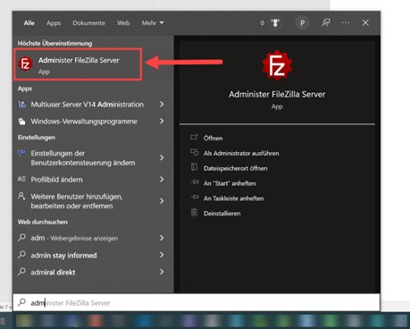

# BadUSB-Attack

## SetupYou can find the following instructions:
- [Installing Filezilla FTP-Server for Windows](#installing-filezilla-ftp-server-for-windows)
- [Configuration Filezilla FTP-Server](#configuration-filezilla-ftp-server)

## Installing Filezilla FTP-Server for Windows

  

## Configuration Filezilla FTP-Server
