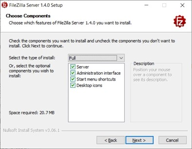
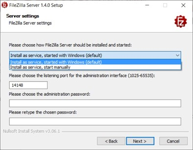
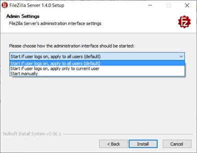
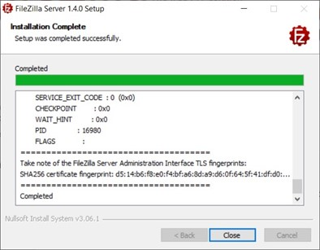
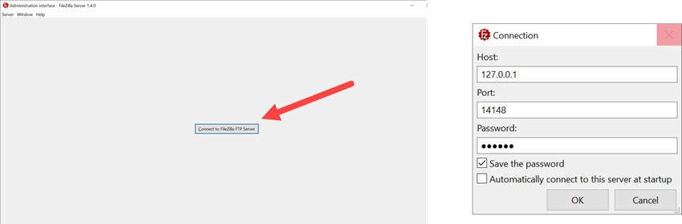
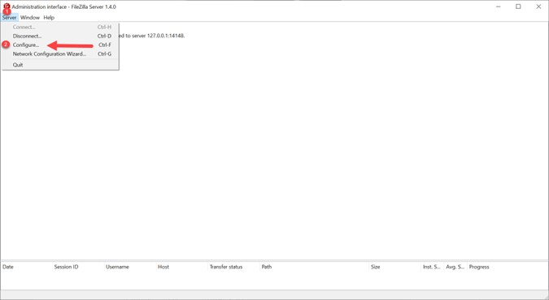
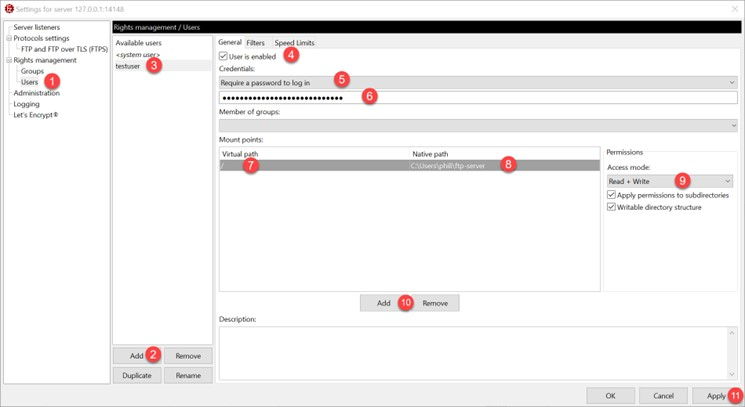
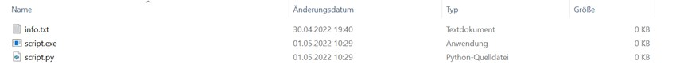

# BadUSB-Attack

## SetupYou can find the following instructions:
- [Installing Filezilla FTP-Server for Windows](#installing-filezilla-ftp-server-for-windows)
- [Configuration Filezilla FTP-Server](#configuration-filezilla-ftp-server)

## Installing Filezilla FTP-Server for Windows
The installation file for the Filezilla-FTP-Server can be downloaded from the official homepage:
[Filezilla FTP-Server](https://filezilla-project.org/download.php?type=server)
 
Once the file has been downloaded and the setup file has been executed, a number of settings must be adjusted.  
It is recommended to install all the components shown in following figure:

  

With the help of the administrator interface the administration of the FTP server is easier and more user-friendly. The desktop icons and the start menu shortcuts make it easy to start and stop the FTP server.
 
In the server settings the FTP-server can be installed either as a service in the Windows startup or as a service that has to be started manually.  
The admin-rator-interface port can also be changed afterwards. This is advisable if another service is already using the default defined port. In addition, an administrator password for the FTP server must be selected here. Whenever something has to be changed on the FTP-server later on, the administrator interface has to be accessed, you will be asked for the password.                                                                                          
   
                                                                                           
 

  

In the next step you can adjust when the administrator interface is started.
 
 

  

The installation of the Filezilla FTP server is now completet:
 
                                                                                           

  

                                                                                          

## Configuration Filezilla FTP-Server
To configure the Filezilla-FTP-Server, the application: "Administer FileZilla Server" has to be started:

  

 
Once the application has been started, the password defined during the installation must be enetered.:
 

  

 
In order to make changes to the FTP-Server, the "Configure" window must be opened. This can be found under the menu item "Server":
 

  

 
Now we have to create a new user within the FTP-Server and set a password for authentication. Furthermore we define to which folder or file the user has access. Having reached the setting point "User" (1), we have to click on the button "Add" (2). The user can be given a name under (3). The user can be activated via (4). In (5) you can define whether a password is required when trying to log on to the FTP-Server. Under (6) the password for the user is defined. The path for the FTP server can be defined under (7). Under (8) is defined, which folder or drive is shared for the user. To define the rights on the Folder or File you can do so under (9). In this case the user has read and write access. At point (10), the settings for the user are confirmed and finally finished at (11):
 

  

 
The "Natice path" has to be set up on the Computer. In this case, a folder has been created in the following directory:  

C:\Users\phili\ftp-server 

 
 
In this folder you can find the content depending on the configured folder structure:
   

  

